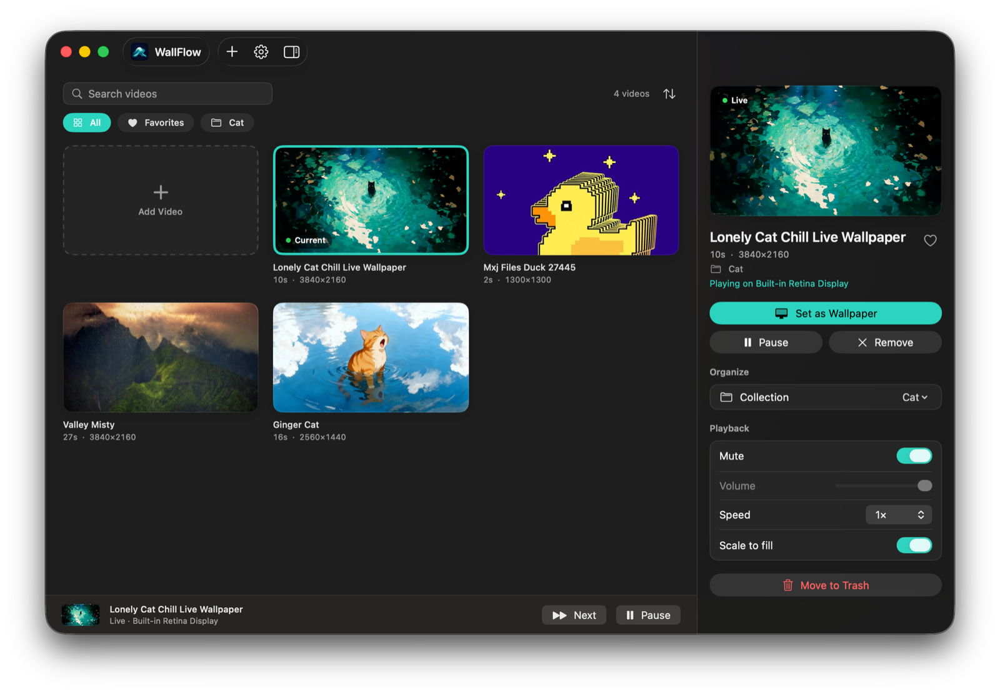

# WallFlow: Live Wallpaper for Mac

<p align="center">
  
</p>

<p align="center">
  <strong>Free, open-source live wallpaper app for macOS.</strong><br>
  Set an MP4, MOV, GIF, or WebM as an animated video wallpaper behind your desktop icons — a native Wallpaper Engine alternative for Mac.
</p>

<p align="center">
  <a href="https://github.com/ritulsingh/WallFlow/releases/latest"></a>
  
  
  <a href="LICENSE"></a>
</p>

macOS only accepts still images as the desktop picture. WallFlow is a **live wallpaper (animated wallpaper) app for Mac** that places a click-through video window just under your desktop icons, so Finder stays fully usable while a video wallpaper loops like the real thing. It supports multiple monitors, wallpaper rotation and playlists, and pauses itself whenever you are not looking at the desktop to save battery. It is built with SwiftUI and AppKit, plays through AVFoundation, and runs natively on Apple Silicon and Intel Macs.

## Screenshots

<p align="center">
  
</p>

<!--
More screenshots: add PNGs to docs/screenshots/ and uncomment.

<p align="center">
  
  
</p>
-->

## Contents

- [Features](#features)
- [WallFlow vs Wallpaper Engine](#wallflow-vs-wallpaper-engine)
- [Requirements](#requirements)
- [Install](#install)
- [Quick start](#quick-start)
- [Using WallFlow](#using-wallflow)
- [Settings reference](#settings-reference)
- [Keyboard shortcuts](#keyboard-shortcuts)
- [Supported formats](#supported-formats)
- [Recommended clips](#recommended-clips)
- [When WallFlow pauses](#when-wallflow-pauses)
- [How it works](#how-it-works)
- [Privacy and permissions](#privacy-and-permissions)
- [Where your data lives](#where-your-data-lives)
- [Troubleshooting](#troubleshooting)
- [FAQ](#faq)
- [Build from source](#build-from-source)
- [Releasing](#releasing)
- [Security](#security)
- [Contributing](#contributing)
- [License](#license)

## Features

**Wallpaper playback**

- Loops a video seamlessly behind your desktop icons, above the still wallpaper
- **Multi-monitor** support: every display can play its own clip, or all of them the same one
- **Per-clip preview** in the app without touching your real desktop
- **Speed** from 0.25× to 2× and a **volume** slider (muted by default)
- **Scale to fill** (crop to cover) or **fit** (letterbox)
- **Frame-rate cap** (30, 24, or 15 fps) to cut CPU, GPU, and battery use
- Optional **desktop picture sync**: also sets a frame of the clip as the real macOS desktop picture so Mission Control, Spaces, and the lock screen match

**Library**

- Import by **drag and drop**, the file picker, or a **direct URL**
- Formats: **MP4, MOV, M4V**, plus **GIF, WebM, MKV, and AVI** converted to MP4 on import
- Large thumbnail grid with **search**, **sorting** (date added, name, duration, resolution)
- **Favorites** and **collections** (folders) with filter chips
- Right-click any clip to set it on one or all displays, favorite it, file it, or move it to the Trash

**Automation**

- **Wallpaper rotation**: change the wallpaper every minute up to once a day, shuffled or in order, from all videos, your favorites, or a single collection
- **Next Wallpaper** button in the app and the menu bar
- Pauses automatically on other apps, fullscreen, lock, display sleep, Low Power Mode, and (optionally) battery
- **Launch at login**

**Everything else**

- Native macOS look that follows your light or dark appearance
- Menu-bar popover with the current wallpaper, play/pause, next, import, and settings
- **Sparkle** auto-updates from GitHub Releases
- No Screen Recording, Accessibility, or Full Disk Access permissions required
- Sandboxed, with your library stored privately in the app's container

## WallFlow vs Wallpaper Engine

[Wallpaper Engine](https://www.wallpaperengine.io) is a popular Windows app for animated desktop wallpapers, and it has no Mac version. WallFlow brings the core idea, video wallpapers on your desktop, to macOS.

| | WallFlow | Wallpaper Engine |
| --- | --- | --- |
| Platform | macOS 14+ (Apple Silicon and Intel) | Windows |
| Price and license | Free, open source (MIT) | Paid, closed source |
| Video wallpapers (MP4, MOV) | Yes | Yes |
| GIF and WebM wallpapers | Yes, converted on import | Yes |
| Multiple monitors | Yes, a different clip per display | Yes |
| Rotation / playlists | Yes | Yes |
| Auto-pause for fullscreen apps, battery, lock | Yes | Yes |
| Community wallpaper catalog (Steam Workshop) | No, bring your own clips | Yes |
| Interactive, web, and scene wallpapers | No, video only | Yes |

WallFlow is deliberately focused: a lightweight, native, battery-friendly video wallpaper engine for the Mac.

## Requirements

- macOS 14 (Sonoma) or later
- Apple Silicon or Intel Mac
- Xcode 16 or later, only if you build from source
- [ffmpeg](https://ffmpeg.org) (optional): only needed to import WebM, MKV, or AVI files. `brew install ffmpeg`

## Install

1. Download **WallFlow-macOS.zip** from the [latest GitHub Release](https://github.com/ritulsingh/WallFlow/releases/latest).
2. Unzip it and drag **WallFlow** into **Applications**.
3. Open WallFlow.

> **Use version 1.3.1 or newer.** Release 1.3.0 (and possibly 1.2.0) is ad-hoc signed in a way that stops the app launching on some Macs ("WallFlow cannot be opened because of a problem"). 1.3.1 fixes it.

### First launch and Gatekeeper

Current releases are signed ad-hoc and are not yet notarized by Apple, so macOS may say it cannot verify the app. To open it anyway:

- Right-click **WallFlow** in Applications, choose **Open**, then **Open** again, or
- Run `xattr -dr com.apple.quarantine /Applications/WallFlow.app` in Terminal.

Once Apple notarization credentials are added to the release pipeline, Gatekeeper will accept the app without this step.

### Updates

WallFlow checks GitHub Releases once a day through [Sparkle](https://sparkle-project.org). You can also choose **Check for Updates…** from the menu bar or **Settings → General**. Turn on automatic install in the Sparkle dialog if you want updates handled for you.

## Quick start

1. Drop a short **MP4, MOV, GIF, or WebM** onto the window, or click **+** and choose **Import from File…** (⌘O).
2. Click a clip to inspect it. This does **not** change your wallpaper.
3. Click **Set as Wallpaper** (or double-click the clip). With more than one display, choose **All Displays** or a specific screen.
4. Click the desktop, or hide windows with **⌘H**, to see the clip behind your icons.

WallFlow keeps running in the menu bar after you close the main window. Use the menu bar icon to pause, skip, reopen the window, or quit.

## Using WallFlow

### The main window

| Area | What it does |
| --- | --- |
| **Grid** (left) | Every clip in your library as a large thumbnail. The selected clip has an accent outline; the current wallpaper shows a **Current** badge. |
| **Filter bar** | Search, a count, and a sort menu. Chips below it filter by **All**, **Favorites**, or a collection. |
| **Details panel** (right) | Preview, title and info, **Set as Wallpaper**, Preview/Pause, favorite, collection, volume, speed, and fill. Toggle it from the toolbar. |
| **Now playing bar** (bottom) | The current wallpaper, its state, **Next**, and **Pause/Resume**. |

### Importing videos

- **Drag and drop** one or more files onto the window.
- **Import from File…** (⌘O) from the **+** menu, or **Add Video** in the grid.
- **Import from URL…** (⇧⌘O) downloads a direct link to a video file. WallFlow pre-fills the field if your clipboard already holds a link. The link must point straight to a file, not to a web page such as YouTube.
- Files are **copied** into WallFlow's library, so you can delete the originals.
- GIF, WebM, MKV, and AVI files are **converted to MP4** during import. See [Supported formats](#supported-formats).

### Favorites, collections, and sorting

- Click the **heart** on a thumbnail (or in the details panel) to favorite a clip.
- **Collections** are folders. Open the **Collection** menu in the details panel to pick an existing one or choose **New Collection…**. A clip belongs to at most one collection, and a collection disappears when its last clip leaves it.
- Filter chips above the grid switch between **All**, **Favorites**, and each collection.
- The sort menu orders the grid by **Date Added**, **Name**, **Duration**, or **Resolution**. WallFlow remembers your choice.

### Multiple displays

- With one display, **Set as Wallpaper** applies to it.
- With several, **Set as Wallpaper** opens a menu: **All Displays** or any single display. Each display can loop a different clip and only assigned displays decode video.
- Right-click a clip for the same options, and the menu bar popover lists what each display is playing.
- Fullscreen apps pause only the display they cover.

### Wallpaper rotation

Turn on **Settings → Rotation → Rotate wallpapers** to cycle through your library automatically.

- **Change**: every minute, 5, 15, 30 minutes, hour, 3 hours, 12 hours, or day
- **Order**: shuffle or in order (oldest first)
- **Videos**: all videos, favorites, or one collection
- **Change Now** jumps to the next clip immediately

Rotation only changes displays that already have a wallpaper, and it waits while playback is paused, the Mac is locked, or the displays are asleep. If your chosen favorites or collection is empty, it falls back to the whole library.

### Menu bar

The menu bar popover shows the current wallpaper, its Live or Paused state, and what each display is playing. It also offers **Play/Pause**, **Next Wallpaper**, **Import Video…**, **Remove Wallpaper**, **Open WallFlow**, **Settings…**, **Check for Updates…**, and **Quit**.

## Settings reference

Open Settings from the gear button, the menu bar, or **⌘,**.

### General

| Option | Default | What it does |
| --- | --- | --- |
| Launch at login | Off | Starts WallFlow with your Mac (may need approval in System Settings → General → Login Items) |
| Also set as desktop picture | Off | Sets a frame of the clip as the real macOS desktop picture. Your original picture is restored when you turn this off or remove the wallpaper. |
| Check for Updates… | | Runs a Sparkle update check |

### Playback

| Option | Default | What it does |
| --- | --- | --- |
| Mute wallpaper | On | Silences the clip |
| Volume | 100% | Volume when unmuted |
| Speed | 1× | 0.25×, 0.5×, 0.75×, 1×, 1.25×, 1.5×, or 2× |
| Scale to fill | On | Crops to cover each display; off letterboxes |

### Rotation

| Option | Default | What it does |
| --- | --- | --- |
| Rotate wallpapers | Off | Enables automatic switching |
| Change | Every 30 minutes | How often to switch |
| Order | Shuffle | Shuffle or in order |
| Videos | All videos | All, Favorites, or a collection |

### Performance

| Option | Default | What it does |
| --- | --- | --- |
| Frame rate | Original | Caps rendering at 30, 24, or 15 fps. Clips already slower than the cap are unaffected. |
| Pause on battery | Off | Stops playback on battery power |
| Pause in Low Power Mode | On | Stops playback when Low Power Mode is on |
| Pause when an app is fullscreen | On | Pauses only the display the app covers |
| Pause while using other apps | On | Plays on the desktop; pauses while you work in another app |

Playback also pauses when the Mac is locked, the displays sleep, or you browse a clip that is not your wallpaper.

## Keyboard shortcuts

| Shortcut | Action |
| --- | --- |
| ⌘O | Import from File… |
| ⇧⌘O | Import from URL… |
| ⌘, | Open Settings |
| ⌘H | Hide WallFlow (reveals the wallpaper) |
| Double-click a clip | Set it as the wallpaper |

## Supported formats

| Format | How it is handled |
| --- | --- |
| **MP4, MOV, M4V** | Copied as-is. H.264 or HEVC gives the best results. |
| **GIF** | Converted to an H.264 MP4 inside WallFlow, keeping each frame's timing. No extra software needed. |
| **WebM, MKV, AVI** | Converted to an H.264 MP4 with **ffmpeg** (quality CRF 18, AAC audio). Requires ffmpeg installed at `/opt/homebrew/bin/ffmpeg` or `/usr/local/bin/ffmpeg` (`brew install ffmpeg`). If ffmpeg is missing, WallFlow tells you. |

macOS itself cannot play WebM, MKV, or GIF as video, which is why they are converted. The original file is never modified.

## Recommended clips

To match Apple's Lock Screen clips so the loop looks native and stays cheap on Apple Silicon:

- 5–15 seconds
- H.264 or HEVC
- Resolution at least as large as your display
- First and last frames that match, for a seamless loop
- Muted, or with the volume you want to hear

## When WallFlow pauses

The wallpaper only decodes video when you can actually see the desktop. It pauses when any of these apply:

- You paused it manually
- The Mac is locked or the display is asleep
- Low Power Mode is on (option)
- The Mac is on battery (option, off by default)
- An app is fullscreen on that display (option)
- Another app is in front of the desktop (option)
- You are previewing or browsing a clip that is not your wallpaper

Finder, the login window, and WallFlow itself never count as "another app". Resuming is automatic.

## How it works

```
Apps / Dock
Desktop icons
WallFlow video window   ← just under the icons, ignores the mouse
macOS still wallpaper
```

- **One window per display.** Each `WallpaperWindow` is a borderless, click-through window one level below Finder's desktop-icon layer. It joins all Spaces and never becomes key or main.
- **Gapless looping.** Each display runs an `AVQueuePlayer` with an `AVPlayerLooper`, so playback stays seamless. Only displays with an assigned clip decode video.
- **Pause logic.** `PlaybackEnvironment` watches power source, Low Power Mode, the frontmost app, lock and sleep notifications, and fullscreen coverage. Fullscreen detection compares window bounds only, so **no Screen Recording permission** is needed. `SettingsStore.shouldEnginePlay` combines everything into one decision.
- **Frame-rate cap.** AVPlayer has no frame-rate setting, so a lower cap is applied through an `AVVideoComposition` frame duration, and only when you enable it.
- **Rotation.** `RotationScheduler` runs a timer and asks the store for the next clip from your chosen pool.
- **Desktop picture sync.** `DesktopStill` renders a full-resolution frame per display and applies it with `NSWorkspace`, remembering your original picture so it can be restored.
- **Conversion.** `MediaConverter` turns GIFs into MP4 with `AVAssetWriter` and shells out to ffmpeg for WebM, MKV, and AVI.

## Privacy and permissions

WallFlow runs in the macOS **App Sandbox** and stores your library in its own container. It does not collect analytics or send your videos anywhere.

- **Network:** only to check for updates on GitHub and to download a link you paste into **Import from URL**
- **Files:** read access only to files you pick, drop, or download
- **No** Screen Recording, Accessibility, Camera, Microphone, or Full Disk Access

Entitlements, and why each exists (`LiveWallpaper/WallFlow.entitlements`):

| Entitlement | Why |
| --- | --- |
| App Sandbox | Standard macOS app isolation |
| `files.user-selected.read-only` | Import files you choose |
| `network.client` | Sparkle updates and Import from URL |
| `cs.disable-library-validation` | Lets the ad-hoc signed app load the embedded Sparkle framework |
| `files.absolute-path.read-only` for `/opt/homebrew/`, `/usr/local/` | Lets WallFlow run a Homebrew-installed ffmpeg for WebM/MKV/AVI |
| Sparkle `mach-lookup` exceptions | Sparkle's installer and downloader services |

## Where your data lives

Because WallFlow is sandboxed, everything is stored inside its container:

```
~/Library/Containers/com.ritulsingh.WallFlow/Data/Library/Application Support/WallFlow/
├── Library/       imported videos (MP4 files)
├── Thumbs/        poster images shown in the grid
├── Stills/        desktop-picture frames (only if that option is on)
└── library.json   your catalog: names, favorites, collections
```

Settings are stored in the app's preferences. To reset WallFlow completely, quit it and delete `~/Library/Containers/com.ritulsingh.WallFlow`. Removing a clip from WallFlow deletes its copy, never your original file.

## Troubleshooting

**The app will not open: "WallFlow cannot be opened because of a problem."**
You have release 1.3.0 (or 1.2.0). Download 1.3.1 or newer from the [Releases page](https://github.com/ritulsingh/WallFlow/releases/latest).

**macOS says WallFlow cannot be verified.**
Right-click the app and choose **Open**, or run `xattr -dr com.apple.quarantine /Applications/WallFlow.app`. See [First launch](#first-launch-and-gatekeeper).

**I set a wallpaper but see nothing.**
Hide your windows with **⌘H** or click the desktop. By default the wallpaper pauses while another app is in front, and it holds its last frame. Also check that WallFlow is not paused (menu bar icon) and that the clip is assigned to that display.

**The wallpaper is paused while I work.**
That is intentional, to save power. Turn off **Settings → Performance → Pause while using other apps** to keep it playing.

**WebM, MKV, or AVI says it needs ffmpeg.**
Install it with `brew install ffmpeg`, then import again. Only the Homebrew locations are supported.

**Import from URL fails.**
The link must point directly to a video file (MP4, MOV, M4V, GIF, WebM, MKV). Pages that embed a player, like YouTube, will not work.

**Playback stutters or my fans spin up.**
Lower **Settings → Performance → Frame rate**, use a clip near your display resolution, and consider **Pause on battery**.

**There is no sound.**
Wallpapers are muted by default. Turn off **Mute** in the details panel or **Settings → Playback**.

**The lock screen or Mission Control still shows my old picture.**
Turn on **Settings → General → Also set as desktop picture**.

**Launch at login does not stick.**
Approve WallFlow in **System Settings → General → Login Items**.

## FAQ

**Can I use a video as my wallpaper on a Mac?**
Not with System Settings alone, which only accepts still images and Apple's built-in dynamic wallpapers. An app like WallFlow plays a video behind your desktop icons instead.

**Is there a Wallpaper Engine for Mac?**
Wallpaper Engine is Windows-only. WallFlow is a free, open-source alternative for macOS that covers video wallpapers, multiple monitors, rotation, and automatic pausing. See [WallFlow vs Wallpaper Engine](#wallflow-vs-wallpaper-engine).

**How do I set a GIF as my wallpaper on a Mac?**
Drop the GIF into WallFlow. It converts it to a looping video and you can set it as your live wallpaper like any other clip.

**Does a live wallpaper drain my Mac's battery?**
WallFlow only decodes video while you can see the desktop. It pauses when another app is in front, an app is fullscreen, the Mac is locked, or Low Power Mode is on, and you can cap the frame rate or pause on battery. See [When WallFlow pauses](#when-wallflow-pauses).

**Can I use different live wallpapers on each monitor?**
Yes. Each display can loop its own clip, or all of them can share one.

**Does WallFlow work on Apple Silicon and Intel Macs?**
Yes. It is a native macOS 14+ app and runs on both.

**Does it work with Spaces and Mission Control?**
The video window appears on every Space. Turn on **Also set as desktop picture** so Mission Control and the lock screen show a matching still frame.

**Is WallFlow free?**
Yes. It is open source under the MIT license.

## Build from source

Requirements: macOS 14+ and Xcode 16+.

1. Open `WallFlow.xcodeproj` in Xcode.
2. Select the **WallFlow** scheme and run it on **My Mac**.

```bash
# Debug build
xcodebuild -project WallFlow.xcodeproj -scheme WallFlow \
  -configuration Debug -destination 'platform=macOS' build

# Optimized zip in dist/WallFlow-macOS.zip
zsh scripts/package.sh
```

Xcode follows the `LiveWallpaper/` folder, so new Swift files are picked up automatically. Swift Package Manager fetches [Sparkle](https://github.com/sparkle-project/Sparkle) on first build.

### Project layout

```
WallFlow.xcodeproj        # scheme and target: WallFlow
LiveWallpaper/            # app sources
  App/                    # @main, AppDelegate, Sparkle updater
  Engine/                 # desktop windows, video loop, pause environment,
                          #   rotation timer, desktop-picture sync
  Store/                  # settings, library, sort/filter, media conversion
  UI/                     # SwiftUI: library grid, details panel, settings,
                          #   menu bar popover, import sheet
  Assets.xcassets
  WallFlow.entitlements
scripts/                  # package.sh, generate-appcast.sh, sign-update.swift
docs/screenshots/         # README images
.github/workflows/        # ci.yml (build) and release.yml (tagged releases)
```

## Releasing

Pull requests and pushes to `main` run a Debug build on GitHub Actions. To publish a release:

1. Bump `MARKETING_VERSION` and `CURRENT_PROJECT_VERSION` in the Xcode project. Sparkle only offers an update when the build number is higher.
2. Commit, then push a tag such as `v1.3.1`.
3. GitHub Actions runs `scripts/package.sh`, builds the Release zip, and publishes a GitHub Release with `WallFlow-macOS.zip` and the Sparkle `appcast.xml`.

For in-app updates, add the GitHub Actions secret `SPARKLE_ED_PRIVATE_KEY` with the contents of `secrets/sparkle_ed_private.key` (gitignored). The matching public key is already in `Info.plist`. Without the secret, releases still publish the zip but not the update feed.

## Security

Found a vulnerability? Please report it privately instead of opening a public issue. See [SECURITY.md](SECURITY.md) for how to report it and what to expect.

## Contributing

Bug reports, small fixes, and focused features are welcome. See [CONTRIBUTING.md](CONTRIBUTING.md) for setup, the project map, and pull-request expectations.

## License

[MIT](LICENSE) © 2026 ritulsingh
